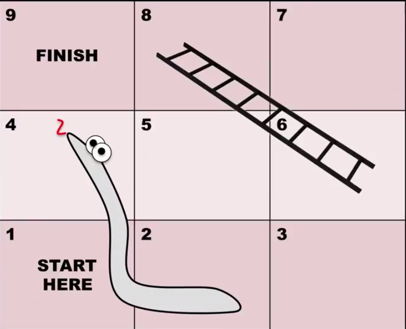
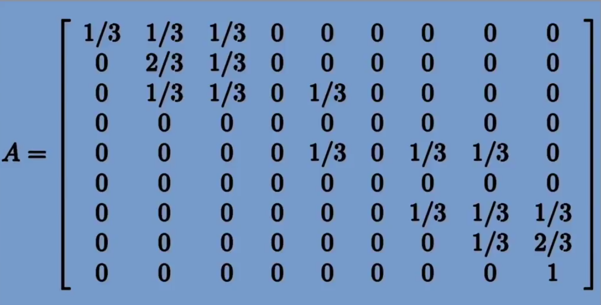
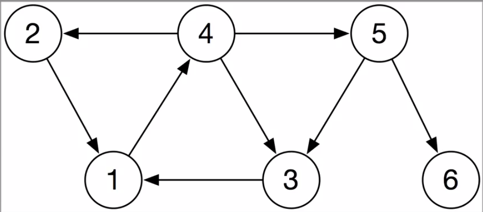
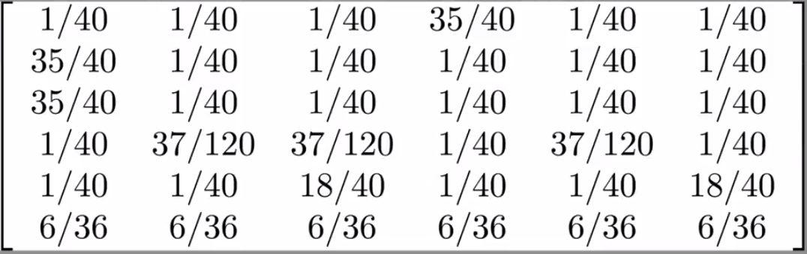




## Using Markov Chains to study probabilistic phenomenon

For the board game above, we want to be able to answer question such as:
* How many minimum number of moves are needed to finish the game?
* What is the probability of being in a given box after n games?

We can solve the above problem using matrix formulation of Markov chains using a transition matrix. For our above game, we get a transition probability matrix as given below.

We start with an initial position vector $$v = \left[ 1\ 0\ 0\ 0\ 0\ 0\ 0\ 0\ 0 \right]$$. We can find the probability after first game as $$v_1 = v.T$$. In general, $$v_k = v_{k-1}.T$$

## PageRank Algorithm
It is easy to find pages that have the desired query, but how do we rank the pages. PageRank ranks the pages on the basis of how likely one is to visit a certain page randomly- it takes the users as random surfers. The algorithm works as follows:

1. Assume that there's 85% chance of following a hyperlink on a page.
2. Also assume that there's 15% chance of visiting any page in the network. That is, the user enters the web address and visits the page directly. This was called teleportation by the original authors.
3. If there are no outlinks in the page one is on, then all the pages are equally likely.

For the above network, we get the following probability matrix.

Now, inorder to actually rank the pages, we start at page 1 and surf randomly. The different probabilities of being on a certain page after $$k$$ surfs is $$v_k = v_{k-1}G$$. Note that we actually don't need to calculate $$v_k$$ recursively, for $$v_k = vG^{k} $$.

For our small network above, $$v_50$$ and even $$v_1000$$ are same for upto five decimal places. What we have found $$v_k$$ is called a steady state vector. This steady state vector has the property $$v = vG$$. But observe that this means that $$v$$ is left eigenvector of $$G$$ with associated eigenvalue of 1 (look Perron's Theroem).

## Smoothing curves
We can also use the power of linear algebra in smoothing curves. One way we can smooth a curve would be as follows:
1. Add mid points to all segments.
2. replace the vertices with some average of previous corresponding points(which include the mid-point we drew).
3. Taking this as the new polygon/ curve (which has more points than we started with), repeat the above process of splitting and averaging.

Now, we know that after applying the process on a vertex (and the two connected segments), after multiple applications, the points will converge. Can we find a matrix that will give us the converged point for any verted? Yes, using right eigenvectors (or eigenvector of transpose of the transformation matrix) corresponding to unit eigenvalue. This eigenvector is the point where the original vertex will converge to.