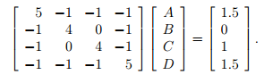




# Bracketology- Ranking teams
Bracketology is the method of predicting the NCAA Basketball teams for the postseason.

### Crazy number of possible brackets.
In a single-elimination case of 64 teams, there are a total of over 9.2 quintillion possible brackets! We can see the combinatorics as $$2^{63} = 9,223,372,036,854,775,808$$. Even with a prediction close to 75% correctness, we have an odd of 1 in 74 million to pick the right bracket.

### Representing  a season of game data using directed graph

Inorder to represent the above game with a matrix (so that we can rank them later), we proceed as follows (Colley method):
* Main diagonal contain the total number of corresponding games + 2.
* Off diagonal elements contain -1 * number of games played between corresponding teams. Remember, rows represent the corresponding team.    
Colley method only deals with wins and losses. We get the right hand side as follow:
* 1 + (1/2 * (wins-losses))
Thus we get the following system of linear equations. Solving for $$x$$ should give us the relevant ratings (from which we get our ranking).    
 
Observe how score is not needed in Colley method.

### Implementing a Bracketology.
Masey method provides another way of ranking where scores matter.
2.1 to form linear system to rank sports teams using the Colley method.
2.2 rand teams given the ratings given by colley method.
